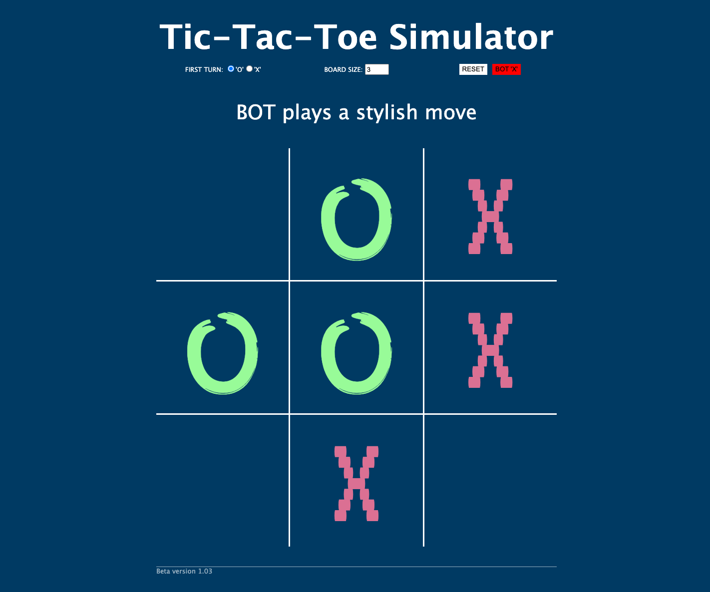

# tic-tac-toe simulator
A responsive tic-tac-toe board that can be adjusted to almost any size for two local players whether its 3x3, 50x50 or more. Optional minimax AI that plays against the user and attempts to dishearten them while they play with cheesy lines. Built using pure HTML/CSS/JS.

Playable here: [https://vjohndo.github.io/tic-tac-toe-bot/](https://vjohndo.github.io/tic-tac-toe-bot/)

>Regular 3x3 mode for player against player

>50x50 mode for player against player

>Minimax algorithm AI bot with cheesy lines

## Instructions
---
- Game will reset on clicking the rest button.
- Radio buttons set who starts the game.
- Game size will set the game size after the game resets. 
- Bot 'X' will engage the bot algorithm it will not work on game sizes other 3.
- Bot 'X' can not be turned off mid game.

## Techonologies used
---
### HTML
- As this simulator is mostly visual there are limited use of HTML elements
- Semantic tags are used to seperate header, main, footer sections
- Three types of inputs are used: radio, number, and button

### CSS
- Imports google fonts for effects
- Multiple classes are used in conjunction with `classList.toggle()` to set different states of HTML elements
- Uses `:root` CSS pseudo-class, representing the HTML to store variables `--some-variable` for use in `calc()`
- Uses `vmin` to make the page somewhat scalable

### JS
- Access the `:root` CSS class variables with `root.style.setProperty('--some-variable', valueForSomeVariable)`
- Create deep copies of objects via `JSON.parse(JSON.stringify(objectToCopy))`

## Features
---
- Implemented minimax algorithim to create a "bot" to play against.
- Boardsize is parametric and scales automatically
- Hovers to show potential moves
- Can set who starts first

## Unsolved Problems
---
- Algorithm doesn't scale, exponential time and space complexity
- Input buttons don't scale 
- Looks bland
- Add in a "loading" or a "calculating" text update while we wait for the bot to load
- If bot is enabled and you spam reset.. stack overflow
- If you set num to high... stack overflow

## References
---
- [Tic Tac Toe: Understanding the Minimax Algorithm](https://www.neverstopbuilding.com/blog/minimax)